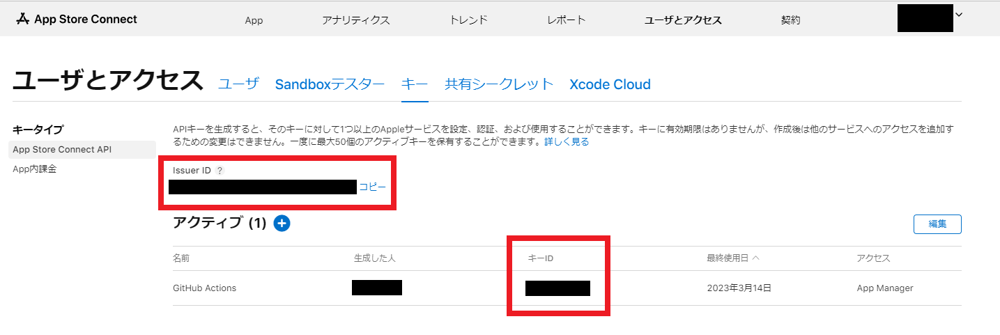

# setup-store-connect-api-json-github-action


This action creates the JSON of the API key to use the Store Connect API.
It also sets the environment variable `APP_STORE_CONNECT_API_KEY_PATH` for fastlane to the JSON file path created.

Key ID and Issuer ID can be obtained from

https://appstoreconnect.apple.com/access/api



## Usage

### Simple usage

```yml
- uses: akiojin/setup-store-connect-api-json-github-action@v0.1.0
  with:
    key-id: ${{ secrets.APPLE_STORE_CONNECT_KEY_ID }}
    issuer-id: ${{ secrets.APPLE_STORE_CONNECT_ISSUER_ID }}
    key: ${{ secrets.APPLE_STORE_CONNECT_KEY }}
```

## Arguments

### Inputs

| Name               | Required | Type      | Default       | Description                                                                                                    |
| ------------------ | -------- | --------- | ------------- | -------------------------------------------------------------------------------------------------------------- |
| `key-id`           | `true`   | `string`  |               | Specifies the Key ID.                                                                                          |
| `issuer-id`        | `true`   | `string`  |               | Specifies the Issuer ID.                                                                                        |
| `in-house`         | `false`  | `boolean` | `false`       | Specify true for Apple Developer Enterprise Program. Otherwise, specify false. If omitted, false is specified. |
| `key`              | `true`   | `string`  |               | Specify the contents of the p8 file downloaded from Store Connect.                                             |
| `output-directory` | `false`  | `string`  | `runner.temp` | Specifies the output directory for JSON files. If omitted, `runner.temp` is set.                               |

### Outputs

| Name          | Type     | Description                       |
| ------------- | -------- | --------------------------------- |
| `output-path` | `string` | The output JSON file path is set. |

## License

Any contributions made under this project will be governed by the [MIT License](https://github.com/akiojin/setup-store-connect-api-json-github-action/blob/main/LICENSE).
